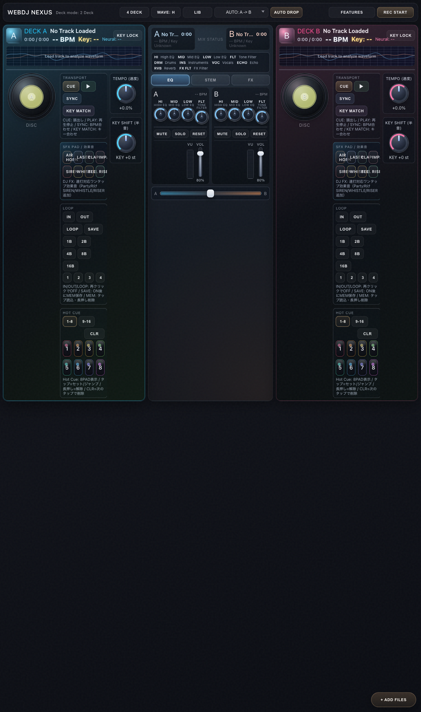

# WebDJ NEXUS

ブラウザだけで動く DJ ミックスアプリです。  
2/4 Deck、Auto Drop / Automix、MIDI Learn、Headphone CUE、録音、Hot Cue、Loop Memory、DJ SHOTS を搭載しています。

---

## JP

### 1分セットアップ（初回向け）

必要環境:
- Node.js 18+
- Chrome / Edge / Safari（最新版）
- MIDI 利用時は Web MIDI 対応ブラウザ

```bash
npm install
npm run dev
```

開発URL（`npm run dev` 実行時に表示された URL を使用）:
- Local 例: `http://localhost:5173`
- LAN 例: `http://192.168.x.x:5173`
  - ポートは `5173` 以外（`5174` など）になる場合があります
  - 例: macOS は `ipconfig getifaddr en0` で IP を確認

本番確認:

```bash
npm run build
npm run preview
```

### クイックスタート

1. `+ ADD FILES` で楽曲を追加  
2. ライブラリで `A/B/C/D` を押してロード  
3. `PLAY` で再生開始  
4. 必要に応じて `SYNC` / `KEY MATCH`  
5. `AUTO DROP` またはクロスフェーダーで遷移  
6. `REC START` で録音開始/停止

### 主要機能（最新実装）

- `2 DECK / 4 DECK`: レイアウト切り替え
- `WAVE: H / WAVE: V`: 波形表示の向き切り替え
- `LIB`: ライブラリ表示トグル
- `AUTO DROP`: 選択ルート（`A->B / B->A / C->D / D->C`）で1回遷移
- `AUTOMIX`: 12秒間隔で Auto Drop を自動実行（ON/OFF）
- `XFADE: SMOOTH / POWER / NEURAL`: トランジション特性切り替え
- `REC START`: マスター出力録音（ブラウザにより `webm` / `m4a` など）

### Deck 機能

#### Transport
- `CUE`: 先頭キューへ戻る
- `PLAY`: 再生/停止
- `SYNC`: 対象デッキ BPM に同期
- `KEY MATCH`: 対象デッキ Key に同期
- `KEY LOCK`: テンポ変更時にキー維持

#### Loop
- `IN / OUT / LOOP`: 手動ループ範囲の作成/有効化
- `1B / 2B / 4B / 8B / 16B`: オートループ
- `SAVE` + `MEM 1-4`: ループメモリ保存/読み込み
- `MEM` 長押し: 保存スロット削除

#### Hot Cue
- 2バンク（`1-8`, `9-16`）、表示は常時8パッド
- タップ: 未設定はセット / 設定済みはジャンプ
- 長押し: 解除
- `CLR`: 次に押した設定済みキューを削除

#### DJ SHOTS
- ワンタップ効果音: `HORN / LASER / CLAP / IMPACT / SIREN / WHISTLE / BELL / RISER`

### FEATURES パネル

- `MIDI CONNECT`: MIDI 接続
- `Learn: ...` + `MIDI LEARN`: 任意の操作を学習割り当て
- `LEARN CANCEL` または `Esc`: 学習モード解除
- `CUE OUT`: ヘッドホン CUE 初期化
- `OUTPUT SCAN`: 出力デバイス再検出
- `CUE A/B`: デッキ別に CUE モニター ON/OFF
- `CUE LV`: CUE 音量
- `MIXER HIDE`: ミキサー表示切り替え
- `GUIDE`: 操作ガイド表示切り替え

### スクリーンショット / GIF

> 画像ファイルを追加したら、以下のパスを差し替えてください。

```md



```

推奨:
- 静止画: `docs/media/*.png`
- デモ: `docs/media/*.gif`

### トラブルシュート

#### Safari で音が出ない
- 最初に画面を1回クリック/タップして AudioContext を有効化
- 自動再生制限と出力デバイス設定を確認

#### MIDI が接続できない
- ブラウザが Web MIDI 対応か確認
- 一度 `MIDI CONNECT` を押して権限許可

#### CUE 出力先を分けられない
- `setSinkId` 未対応ブラウザではデフォルト出力のみ
- `OUTPUT SCAN` 実行後に出力デバイス選択

---

## EN

### 1-minute setup

Requirements:
- Node.js 18+
- Latest Chrome / Edge / Safari
- Web MIDI compatible browser if you use MIDI controllers

```bash
npm install
npm run dev
```

Dev URLs (use the URLs printed by `npm run dev`):
- Local example: `http://localhost:5173`
- LAN example: `http://192.168.x.x:5173`
  - The port may change (`5174`, etc.) if the default port is already in use
  - Example (macOS): run `ipconfig getifaddr en0` to check your current IP

Production preview:

```bash
npm run build
npm run preview
```

### Quick start

1. Import tracks with `+ ADD FILES`  
2. Load tracks to `A/B/C/D` from the library  
3. Press `PLAY`  
4. Use `SYNC` / `KEY MATCH` as needed  
5. Transition via `AUTO DROP` or crossfader  
6. Record with `REC START`

### Core features

- 2/4 deck layout toggle
- Horizontal / vertical waveform mode
- Auto Drop routes (`A->B / B->A / C->D / D->C`)
- Automix loop (runs Auto Drop every 12s)
- Transition styles (`SMOOTH / POWER / NEURAL`)
- Headphone CUE routing (browser support dependent)
- MIDI Learn with persistent mapping in `localStorage`
- Deck tools: Hot Cue (16 slots), Loop Memory (4 slots), DJ SHOTS, Key Lock, Sync, Key Match
- Master recording export (`webm`, `m4a`, etc. depending on browser)

### Screenshots / GIF

```md


```

### Source structure

- `src/main.ts`: app bootstrap, header controls, routing/events, recording, CUE output
- `src/ui/DeckUI.ts`: deck controls, hot cue, loop memory, DJ SHOTS, jog/knob UI
- `src/audio/AutoDrop.ts`: auto transition logic for Auto Drop / Automix
- `src/midi/MidiController.ts`: MIDI connect + learn + mapping dispatch
