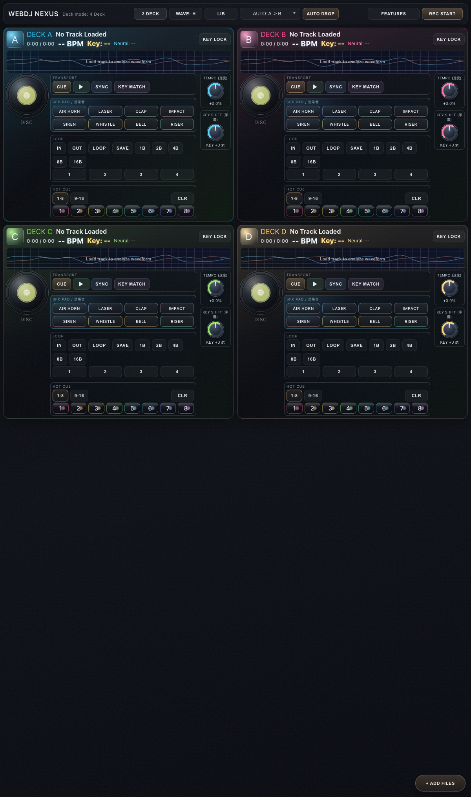
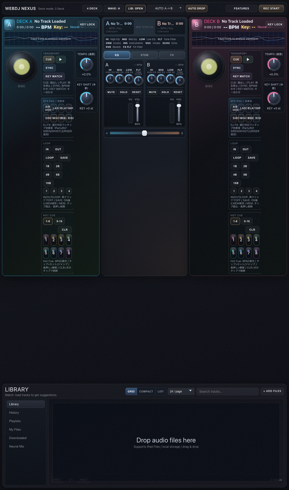
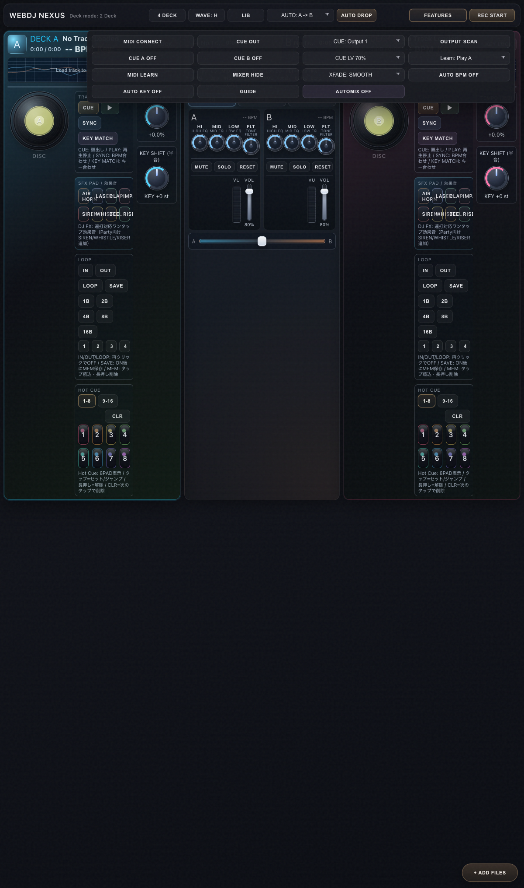

# WebDJ NEXUS

ブラウザだけで動くプロ仕様の DJ ミックスアプリです。  
2/4 Deck、AI 音源分離 (ONNX WebGPU/WASM)、Auto Drop / Automix、MIDI Learn、Headphone CUE、録音、Hot Cue (16 スロット)、Loop Memory、DJ SHOTS、EQ / STEM / FX ミキサー、XY パッド — Web Audio API の限界に挑戦しています。

> **対応ブラウザ:** Chrome / Edge / Safari（最新版）  
> **MIDI 対応:** Web MIDI のあるブラウザ  
> **AI 分離 (ONNX):** WebGPU 対応ブラウザで最も高速動作

---

## 目次

- [1分セットアップ](#1分セットアップ初回向け)
- [クイックスタート](#クイックスタート)
- [Deck 機能](#deck-機能)
- [ミキサー機能](#ミキサー機能)
- [FEATURES パネル](#features-パネル)
- [録音機能](#録音機能)
- [AI 音源分離 (Neural Separation)](#ai-音源分離-neural-separation)
- [MIDI マッピング](#midi-マッピング)
- [プロジェクト構成](#プロジェクト構成)
- [トラブルシュート](#トラブルシュート)
- [EN](#en)

---

## 1分セットアップ（初回向け）

### 必要環境

- **Node.js 18+**
- Chrome / Edge / Safari（最新版）
- MIDI 利用時は Web MIDI 対応ブラウザ

```bash
# 依存関係インストール
npm install

# 開発サーバー起動
npm run dev
```

開発URL（`npm run dev` 実行時に表示された URL を使用）:

- Local: `http://localhost:5173`
- LAN: `http://192.168.x.x:5173`
  - 初期ポート `5173` が使用中の場合、`5174` などに自動変更されます
  - macOS の場合 `ipconfig getifaddr en0` で IP 確認

### 本番ビルド

```bash
npm run build    # TypeScript チェック → Vite ビルド
npm run preview  # ビルド結果をプレビュー
```

### AI 音源分離モデル（任意）

デフォルトではハイブリッドフィルター分離で動作します。  
ONNX モデルを配置することで WebGPU/WASM による本格的な AI 音源分離が有効になります。

```
# ONNX モデルを配置
public/models/neuralmix.onnx

# オプション設定ファイル (モデルに合わせて調整)
public/models/neuralmix.config.json
```

詳細は [`public/models/README.md`](public/models/README.md) を参照。

---

## クイックスタート

1. **`+ ADD FILES`** で楽曲をインポート
2. **ライブラリ**で A/B/C/D ボタンを押してデッキにロード
3. **`PLAY`** で再生開始
4. 必要に応じて **`SYNC`** / **`KEY MATCH`**
5. **`AUTO DROP`** またはクロスフェーダーでミックス遷移
6. **`REC START`** で録音開始 / 停止

### ヘッダーコントロール

| 操作 | 説明 |
|---|---|
| `4 DECK` / `2 DECK` | レイアウト切り替え |
| `WAVE: H` / `WAVE: V` | 波形の向き（横 / 縦） |
| `LIB` / `LIB: OPEN` | ライブラリパネルの表示トグル |
| `AUTO DROP` | 選択ルートで一度だけ自動遷移 |
| `AUTOMIX OFF` / `ON` | 12秒間隔の定期自動ミックス |
| `FEATURES` | MIDI / CUE / 機能設定パネル |
| `REC START` | マスター出力録音 |

### AUTO DROP / AUTOMIX の使い方

1. `FEATURES` を開く
2. **`AUTO BPM` / `AUTO KEY`** を必要に応じて ON に（デフォルト OFF）
3. ルート選択（`A->B` / `B->A` / `C->D` / `D->C`）
4. **手動遷移:** `AUTO DROP` を押す
5. **定期遷移:** `AUTOMIX ON` で 12 秒間隔で自動実行
6. `XFADE: SMOOTH / POWER / NEURAL` でトランジション特性を選択

---

## Deck 機能

各デッキは完全なオーディオグラフを持ち、3 ステム（Drums / Instruments / Vocals）で構成されています。

### Transport（トランスポート）

| 操作 | 説明 |
|---|---|
| **CUE** | 先頭キュー（0 秒地点）へシーク |
| **PLAY** | ▶ 再生 / ⏸ 停止 — トグル |
| **SYNC** | 再生中または BPM が既知のデッキにテンポ同期 |
| **KEY MATCH** | 再生中デッキのキーに半音合わせ |
| **KEY LOCK** | テンポ変更時にピッチを維持（ノート検出オフ） |

### Loop（ループ）

- **IN / OUT / LOOP:** 手動ループ範囲の作成・有効化
- **1B / 2B / 4B / 8B / 16B:** BPM 連動オートループ（再度タップで OFF）
- **SAVE → MEM 1-4:** ループスロットに保存
- **MEM 長押し（または右クリック）:** 保存スロット削除

### Hot Cue（ホットキュー）

- **2 バンク切り替え（1-8 / 9-16）:** 常時 8 パッド表示
- **タップ:** 未設定 → セット / 設定済み → ジャンプ
- **長押し（または右クリック）:** 解除
- **CLR ON → 設定済みパッドタップ:** 一発削除
- 各キューのカラーはプリセットから自動割り当て

### Pitch / Key Control

- **TEMPO ノブ:** -75%〜+75% 可変
- **KEY SHIFT ノブ:** ±12 半音（キーロック連動）
- ダブルクリックでリセット
- Shift + ドラッグで微調整

### Jog Wheel（ジョグホイール）

- ビニール風デザイン（アートワーク連動カラー）
- ドラッグでスクラッチ / 位置調整
- 再生中アニメーション回転

### SFX PAD（効果音）

8 種類のワンタップ効果音（Web Audio シンセサイザー生成）:

| パッド | 説明 |
|---|---|
| **AIR HORN** | エアホーン（オシレーター合成） |
| **LASER** | レーザー効果音 |
| **CLAP** | マルチレイヤークラップ |
| **IMPACT** | 低域インパクト |
| **SIREN** | サイレン（LFO変調） |
| **WHISTLE** | 下降ホイッスル（ビブラート） |
| **BELL** | カウベル |
| **RISER** | ビルドアップライザー |

---

## ミキサー機能

中央パネルはタブ切り替え式で、EQ / STEM / FX を個別に操作できます。

### トラックライン（上部）

再生中の A/B デッキの曲名・BPM・キー・経過時間を常時表示。

### EQ / Filter（イコライザー・フィルター）

| ノブ | 帯域 |
|---|---|
| **HI** | High-shelf (3.6kHz〜) ±18dB |
| **MID** | Peaking (1kHz) ±18dB |
| **LOW** | Low-shelf (320Hz〜) ±18dB |
| **FLT** | Tone Filter（左: ローパス / 右: ハイパス）|

### Stem Level（ステムレベル）

AI 分離された 3 つのステムを個別にフェード:

- **DRM** — Drums
- **INS** — Instruments  
- **VOC** — Vocals

### FX（エフェクト）

- **ECHO** — ディレイ（350ms / フィードバック 40%）
- **RVB** — コンボリューションリバーブ（インパルス応答生成）
- **FX FLT** — ローパスフィルタースイープ（20kHz → 200Hz）

### XY Pad

デッキ A/B それぞれに XY パッド:

- **X 軸:** Filter blend（-1〜+1）
- **Y 軸:** Reverb amount（0〜95%）

ダブルクリックで中央リセット。

### Channel Tools

| 操作 | 説明 |
|---|---|
| **MUTE** | チャンネルミュート |
| **SOLO** | 選択チャンネルのみ出力 |
| **RESET** | EQ / Stem / FX / Volume を全リセット |
| **Volume Fader** | 各チャンネル音量（0-100%）|

### Mix Macros（ミックスマクロ）

ワンタップでミックス構築を補助:

| マクロ | 効果 |
|---|---|
| **BASS CUT** | Low EQ を -14dB にカット |
| **BRIGHT+** | High +8dB / Mid +2dB で高域強調 |
| **VOCAL FOCUS** | Vocal 100% / Inst 34% / Drums 22% |
| **DRUM FOCUS** | Drums 100% / Inst 48% / Vocal 24% |

### Crossfader

- 等パワークロスフェード（cos² / sin² 則）
- AUTO DROP / AUTOMIX によるアニメーション制御対応
- MIDI CC コントロール対応

### VU Meter

周波数スペクトラムベースのセグメント表示 VU メーター（28 セグメント / 3 ゾーンカラー）。

---

## FEATURES パネル

### MIDI 関連

| 操作 | 説明 |
|---|---|
| **MIDI CONNECT** | MIDI コントローラー接続 |
| **Learn: ...** | 学習対象を選択 |
| **MIDI LEARN** | 学習モード開始（次に受信した MIDI 信号を割り当て） |
| **LEARN CANCEL** | 学習モード解除（Esc キーでも可） |

デフォルトマッピングは [`src/midi/MIDI_MAPPING.md`](src/midi/MIDI_MAPPING.md) を参照。  
マッピングは `localStorage` に自動保存されます。

### CUE / ヘッドホン

| 操作 | 説明 |
|---|---|
| **CUE OUT** | ヘッドホン CUE 出力初期化 |
| **CUE A / B** | 各デッキの CUE 送信 ON/OFF |
| **CUE LV** | CUE 音量（55% / 70% / 85% / 100%） |
| **OUTPUT SCAN** | 出力デバイス再検出 |
| **CUE: ...** | CUE 出力先デバイス選択（`setSinkId` 対応ブラウザのみ）|

### Transition Style

| スタイル | 説明 |
|---|---|
| **SMOOTH** | Echo + Reverb を自然にかけながら遷移（6.8 秒） |
| **POWER** | Echo + Filter で盛り上げて遷移（3.6 秒） |
| **NEURAL** | ステムレベル操作 + Echo で分離感を活かした遷移（5.6 秒） |

---

## 録音機能

- マスター出力をブラウザの MediaRecorder で録音
- 対応形式: webm (Opus) / mp4 (AAC) — ブラウザ自動選択
- 録音中はタイマー表示
- 停止後自動ダウンロード（ファイル名: `webdj-session-YYYY-MM-DD...`）

---

## AI 音源分離 (Neural Separation)

各デッキはロード時に自動で音源分離を実行します。

### 分離モード（自動選択）

| モード | 条件 |
|---|---|
| **ONNX WebGPU** | GPU 利用可能時 — 最速 |
| **ONNX WASM** | CPU のみ — 安定動作 |
| **Hybrid（フィルター分離）** | ONNX モデル未配置・エラー時 — 常に動作 |

### キャッシュ

- 分離結果はファイルごとにキャッシュ（最大 8 エントリ）
- 同一ファイルの再ロード時はキャッシュから即座に復元
- 進行状況バーで分離進捗を表示

### 制御（ラブラリ Neural Mix タブまたはミキサー STEM パネル）

- 各ステムの音量をスライダーで個別調整
- プリセット: **VOCAL FOCUS** / **DRUM FOCUS** / **RESET**

---

## MIDI マッピング

デフォルトの MIDI マッピングは [`src/midi/MIDI_MAPPING.md`](src/midi/MIDI_MAPPING.md) に記載。

| ターゲット | タイプ | デフォルト CC/Note |
|---|---|---|
| Play A/B | Note | 36/37 |
| Cue A/B | Note | 40/41 |
| Sync A/B | Note | 42/43 |
| Key Match A/B | Note | 44/45 |
| Crossfader | CC | 0 |
| Volume A/B | CC | 1/2 |
| Tempo A/B | CC | 5/6 |
| Filter A/B | CC | 9/10 |
| Stem Vocal A/B | CC | 11/12 |
| Stem Drums A/B | CC | 13/14 |
| Stem Inst A/B | CC | 15/16 |

**MIDI LEARN の使い方:**

1. `FEATURES` を開く
2. `Learn:` セレクトボックスで割り当てたい操作を選択
3. `MIDI LEARN` をクリック
4. コントローラーのノブ・フェーダー・パッドを操作
5. マッピングは自動保存、次回起動時も維持

---

## プロジェクト構成

```
public/
  models/
    README.md               # ONNX モデル配置ガイド
    neuralmix.config.example.json  # モデル設定例
src/
  main.ts                   # アプリ起動・ヘッダーUI・イベント統括・録音
  style.css                 # 全UIスタイル（ダークテーマ）
  audio/
    AudioEngine.ts           # AudioContext / マスター出力 / CUE / 録音
    Deck.ts                  # デッキ実装（3ステム再生・EQ・FX・ループ・キューの全て）
    Crossfader.ts            # 等パワークロスフェーダー
    AutoDrop.ts              # AUTO DROP / AUTOMIX 遷移ロジック
    Effects.ts               # Echo / Reverb / Filter エフェクト
    BPMDetector.ts           # ピーク間隔分析によるBPM検出
    NeuralSeparator.ts       # ONNX WebGPU/WASM 音源分離 + ハイブリッドフォールバック
    SfxEngine.ts             # シンセサイザー効果音（8種類）
    cuePalette.ts            # ホットキューの配色プリセット（16色）
  ui/
    DeckUI.ts                # デッキUI（ジョグ・コントロール・ホットキュー・ループ）
    MixerUI.ts               # ミキサーUI（EQ/STEM/FX・XYパッド・VU・クロスフェーダー）
    LibraryUI.ts             # ライブラリUI（ファイル管理・履歴・プレイリスト・Neural Mix）
  midi/
    MidiController.ts        # MIDI接続・学習・マッピング
    MIDI_MAPPING.md          # デフォルトMIDIマッピングドキュメント
  visualizer/
    Waveform.ts              # 波形描画（横/縦・ビートグリッド・ループ/キューマーカー）
```

### アーキテクチャのポイント

- **Web Audio API** — 全てのオーディオ処理は `AudioContext` + `AudioNode` グラフで構成
- **3 ステム分離** — 各デッキのオーディオグラフは Drums / Instruments / Vocals の並列チェーン
- **宣言的レンダリングなし** — DOM は innerHTML と直接更新で管理（軽量フレームワーク不要）
- **イベントバス** — カスタムイベント (`status-message`, `sync-request`, `sfx-trigger` 等) でコンポーネント間連携
- **設定永続化** — MIDI マッピング・手動プレイリストは `localStorage` に保存

---

## スクリーンショット / GIF

| 画面 | 説明 |
|---|---|
|  | **2-Deck モード** — 左右のデッキコントロール、中央ミキサーパネル、ヘッダーコントロール |
|  | **4-Deck モード** — 4 デッキ表示 (A/B/C/D)、全チャンネル独立制御 |
|  | **EQ / STEM / FX ミキサー** — 3 バンド EQ、フィルター、ステムレベル、エフェクトコントロール |
|  | **ライブラリパネル** — 楽曲管理、履歴、プレイリスト、Neural Mix 設定 |
|  | **FEATURES 設定** — MIDI Learn、CUE ルーティング、トランジションスタイル選択 |

> スクリーンショットは `docs/media/` に保存されています。

---

## トラブルシュート

### Safari で音が出ない

- 最初に画面を 1 回クリック / タップして AudioContext を有効化
- 自動再生制限と出力デバイス設定を確認

### MIDI が接続できない

- Web MIDI 対応ブラウザ（Chrome / Edge）を使用
- `MIDI CONNECT` を押して権限許可

### CUE 出力先を分けられない

- `setSinkId` は Safari / Chrome 限定
- 未対応ブラウザでは CUE とマスターは同一出力

### AI 分離が Hybrid から変わらない

- ONNX モデル未配置のままの正常動作です
- WebGPU / WASM 使用時はブラウザのコンソールに分離モードが表示されます

### ビルドエラー

```bash
# TypeScript エラーを確認
npx tsc --noEmit

# node_modules を再インストール
rm -rf node_modules && npm install
```

---

# EN

## WebDJ NEXUS — Browser-based DJ Console

A professional DJ mixing application that runs entirely in your browser.  
Powered by Web Audio API, Web MIDI, and ONNX Runtime Web.

### Quick Start

```bash
npm install
npm run dev
```

### Features Overview

- **2/4 Deck layout** — toggle between 2-deck and 4-deck modes
- **AI Stem Separation** — ONNX WebGPU/WASM with hybrid spectral fallback
- **3-stem architecture** — Drums / Instruments / Vocals per deck
- **Auto Drop & Automix** — one-shot or 12s periodic transitions with 3 styles
- **Smart Transitions** — SMOOTH (echo+reverb), POWER (echo+filter), NEURAL (stem crossfade)
- **MIDI Learn** — assign any knob/fader/pad to 20+ targets with persistent mapping
- **Headphone CUE** — per-deck cue routing with `setSinkId` device selection
- **Master Recording** — MediaRecorder export (webm / m4a)
- **Hot Cue** — 16 slots (2 banks), set/jump/long-press clear/CLR mode
- **Loop Memory** — 4 saved slots per deck, save/load/long-press clear
- **Loop** — Manual IN/OUT, auto quantized (1B~16B)
- **8 SFX Pads** — Synthesized one-shots (Airhorn, Laser, Clap, Impact, Siren, Whistle, Bell, Riser)
- **3-band EQ + Tone Filter** — ±18dB shelves/peak + low/high-pass filter
- **Echo / Reverb / FX Filter** — Per-deck effects chain
- **XY Pad** — Simultaneous filter + reverb control per deck
- **VU Meter** — 28-segment spectrum-based level display
- **Mix Macros** — BASS CUT, BRIGHT+, VOCAL FOCUS, DRUM FOCUS
- **MUTE / SOLO / RESET** — Per-channel controls
- **Library** — Grid/compact/list views, search, pagination, smart playlists (BPM-based), manual playlists with localStorage persistence
- **Harmonic Matching** — Smart suggestions based on BPM, key, and energy
- **BPM Detection** — Peak-interval algorithm with histogram clustering
- **Key Estimation** — Krumhansl-Schmuckler profile matching (major/minor)
- **Waveform** — Horizontal/vertical modes, beat grid, loop/cue markers, click-to-seek
- **Headless event bus** — Custom DOM events for component communication

### Project Structure

```
public/models/        ← ONNX model location
src/main.ts           ← App bootstrap and orchestration
src/audio/            ← Audio engine, Deck, Crossfader, AutoDrop, Effects, BPM, Neural, SFX
src/ui/               ← DeckUI, MixerUI, LibraryUI
src/midi/             ← MidiController, default mapping docs
src/visualizer/       ← Waveform renderer
src/style.css         ← Complete dark theme stylesheet
```

### Supported Browsers

- Chrome (best ONNX WebGPU support)
- Edge
- Safari (no setSinkId, fallback hybrid separation)

### Troubleshooting

- **No audio on Safari:** Tap the screen once to activate AudioContext
- **MIDI not connecting:** Use Chrome/Edge for Web MIDI
- **CUE output can't be split:** setSinkId is Chrome/Safari only
- **Hybrid separation only:** ONNX model is optional — hybrid works automatically
- **Build errors:** Run `npx tsc --noEmit` to check types
